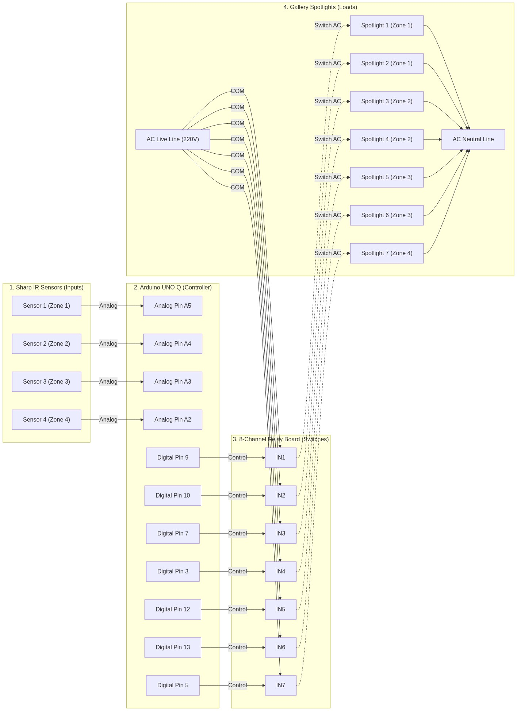
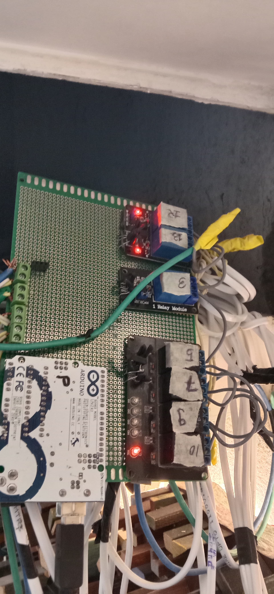
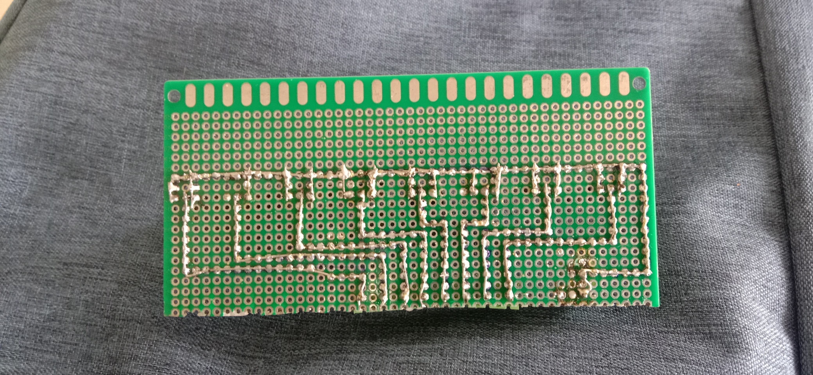

# 🏆 Sandhi Cement Smart Gallery Lighting System

An award-winning, production-grade interactive lighting automation system designed and deployed for the **Sandhi Cement Art Gallery** located on the **Kataria Arcade (10th Floor)**.

The system uses real-time proximity-sensing microcontroller logic to dynamically track visitor movements and switch spotlights, creating an immersive, interactive art gallery experience while maximizing energy efficiency.

---

## ⚡ Key Features
1. **Real-Time Proximity Spotlight Control**: Reads 4-zone **Sharp GP2Y0A02YK0F IR Distance Sensors** to detect visitor locations in front of art pieces.
2. **Optocoupler-Isolated Switching**: Dynamic switching of high-power 10W COB LED spotlights through an 8-channel relay board.
3. **Standby Energy-Saving Zigzag Scan**: Activates an automated spotlight sweep pattern when the gallery is empty (idle) to conserve power.
4. **Arduino® UNO™ Q Onboard Visualization**: Employs the onboard 8x13 blue LED matrix to show diagnostic location maps for engineers.

---

## 📋 Bill of Materials (BOM)
| Category | Component Name | Description / Specifications | Qty | Unit Cost (INR) | Subtotal (INR) |
|---|---|---|---|---|---|
| **Electronics** | **Arduino® UNO™ Q** | Main hybrid controller (STM32 MCU + Qualcomm MPU) | 1 | ₹5,999 | ₹5,999 |
| **Electronics** | **Sharp GP2Y0A02YK0F** | Analog IR Distance Sensors (20cm - 150cm range) | 4 | ₹599 | ₹2,396 |
| **Electronics** | **8-Channel Relay Board** | 5V Optocoupler-isolated relay switching board | 1 | ₹450 | ₹450 |
| **Electronics** | **LM2596 Buck Converter** | Step-down regulator (12V to 5V for relays) | 1 | ₹120 | ₹120 |
| **Wiring** | **12V 2A DC Adapter** | FR-Grade power supply for controller & relays | 1 | ₹350 | ₹350 |
| **Wiring** | **Solid Copper Wires** | Red/Black/Yellow/Blue connection wire lot (10m each) | 1 | ₹250 | ₹250 |
| **Wiring** | **3-Core AC Mains Cable** | 1.5 sq mm copper wire for spotlights (15m length) | 1 | ₹450 | ₹450 |
| **Hardware** | **Custom Acrylic Box** | Laser-cut clear acrylic enclosure for wall mount | 1 | ₹600 | ₹600 |
| **Hardware** | **Brass Standoffs Kit** | M3 screws & standoffs board mounting kit (50pcs) | 1 | ₹150 | ₹150 |
| **Hardware** | **Cable Ties & Mounts** | Nylon wire management and mounting clips pack (100pcs) | 1 | ₹100 | ₹100 |
| **Lighting** | **10W COB LED Spotlights** | Warm White high-CRI spotlights for art frames | 7 | ₹500 | ₹3,500 |
| **Tools** | **Wire Stripper & Cutter** | Multi-functional hand tool for clean wire preparation | 1 | ₹250 | ₹250 |
| **Tools** | **60W Soldering Iron Kit** | Temp-controlled soldering iron with solder & flux | 1 | ₹650 | ₹650 |
| **Consumables** | **Heat Shrink Tubing Kit** | Flame-retardant insulating sleeves kit (127pcs) | 1 | ₹150 | ₹150 |
| **Consumables** | **Nitto Electrical Tape** | FR Grade insulating electrical tape (2 rolls) | 2 | ₹40 | ₹80 |
| **Consumables** | **Hot Melt Glue Gun** | 100W glue gun with 10 sticks (for sensor mounting) | 1 | ₹350 | ₹350 |
| **Total Cost** | | **Comprehensive Bill of Materials (All costs included)** | | | **₹15,845** |

---

## ⚡ Circuit Connection Diagram
The horizontal schematic lays out the flow of power and signals across components:

---

## 💻 Firmware Code Structure
*   **[`src/Sandhi_Cement_Smart_Lighting_System/Sandhi_Cement_Smart_Lighting_System.ino`](src/Sandhi_Cement_Smart_Lighting_System/Sandhi_Cement_Smart_Lighting_System.ino)**: Standalone firmware running directly on the STM32 MCU of the Uno Q. It handles raw distance metric processing, mathematical curve fitting, and relay switching.

---

## 📸 Media & Gallery
Here are some snapshots of the hardware and assembly process:

| Component Assembly | MOSFET/Wiring Conduits | Soldering & Installation |
|---|---|---|
|  |  |  |
