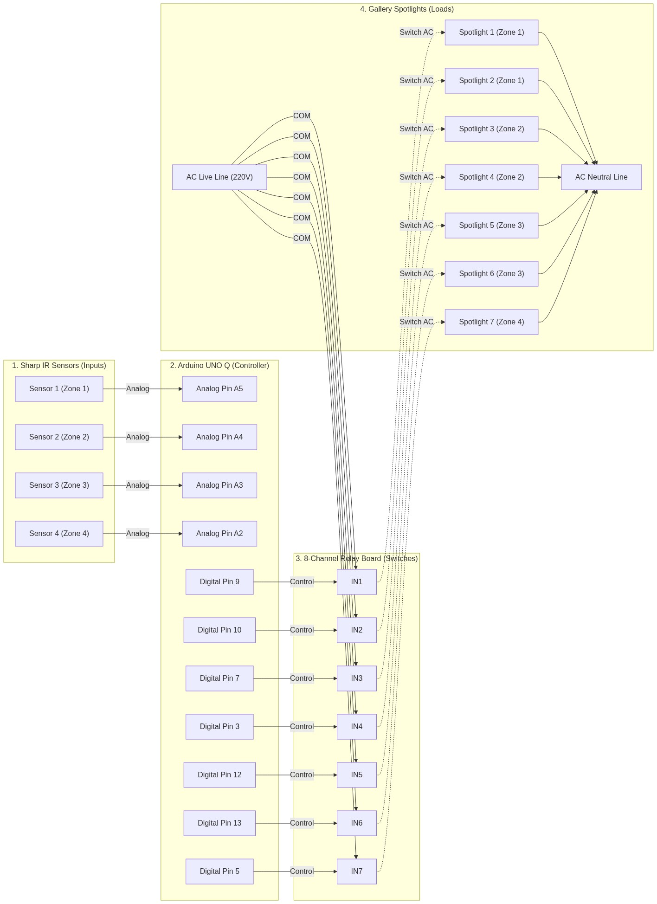

# 🏆 Sandhi Lumina: Autonomous Art-Tracking Lighting System

**Sandhi Lumina** is a real-world, production-grade interactive automation system deployed at the **Kataria Arcade (10th Floor)** for **Sandhi Cement**. 

The system leverages smart human-tracking algorithms and high-speed microcontroller logic to dynamically spotlight art displays based on visitor presence, achieving a premium interactive gallery experience while optimizing energy consumption.

---

## ⚡ Key Technical Features
1. **Real-Time Human-Tracking**: A 4-zone array of **Sharp GP2Y0A02YK0F IR Distance Sensors** scans visitor proximity (20cm - 150cm).
2. **Dynamic Spotlight Swapping**: An 8-channel optocoupler-isolated relay board switches high-power 10W COB LED spotlights to track visitor paths.
3. **Standby Zigzag Animation**: When the gallery is empty (idle mode), the system switches to an energy-saving **zigzag sweep sweep animation**, keeping the space ambient while drawing minimal power.
4. **Arduino® UNO™ Q Edge**: Upgrading to the hybrid Uno Q allows local execution of the sensor loop on the STM32 MCU, freeing up the MPU and running matrix diagnostics on the onboard 8x13 blue LED display.

---

## 📋 Bill of Materials (BOM)
| Category | Component Name | Description / Specifications | Qty | Unit Cost (INR) | Subtotal (INR) |
|---|---|---|---|---|---|
| **Electronics** | **Arduino® UNO™ Q** | Main hybrid controller (STM32 MCU + Qualcomm MPU) | 1 | ₹5,999 | ₹5,999 |
| **Electronics** | **Sharp GP2Y0A02YK0F** | Analog IR Distance Sensors (20cm - 150cm range) | 4 | ₹599 | ₹2,396 |
| **Electronics** | **8-Channel Relay Module** | 5V Optocoupler-isolated relay switching board | 1 | ₹450 | ₹450 |
| **Electronics** | **LM2596 Buck Converter** | Step-down regulator (12V to 5V for relays) | 1 | ₹120 | ₹120 |
| **Wiring** | **12V 2A DC Adapter** | FR-Grade power supply for controller & relays | 1 | ₹350 | ₹350 |
| **Wiring** | **Solid Copper Wires** | Red/Black/Yellow/Blue connection wire lot (10m each) | 1 | ₹250 | ₹250 |
| **Wiring** | **3-Core AC Mains Cable** | 1.5 sq mm copper wire for spotlights (15m length) | 1 | ₹450 | ₹450 |
| **Hardware** | **Custom Acrylic Box** | Laser-cut clear acrylic enclosure for wall mount | 1 | ₹600 | ₹600 |
| **Hardware** | **Brass Standoffs Kit** | M3 screws & standoffs board mounting kit (50pcs) | 1 | ₹150 | ₹150 |
| **Hardware** | **Cable Ties & Mounts** | Nylon wire management and mounting clips pack (100pcs) | 1 | ₹100 | ₹100 |
| **Lighting** | **10W COB LED Spotlights** | Warm White high-CRI spotlights for art frames | 7 | ₹500 | ₹3,500 |
| **Tools** | **Wire Stripper & Cutter** | Multifunctional hand tool for clean wire preparation | 1 | ₹250 | ₹250 |
| **Tools** | **60W Soldering Iron Kit** | Temp-controlled soldering iron with solder & flux | 1 | ₹650 | ₹650 |
| **Consumables** | **Heat Shrink Tubing Kit** | Flame-retardant insulating sleeves kit (127pcs) | 1 | ₹150 | ₹150 |
| **Consumables** | **Nitto Electrical Tape** | FR Grade insulating electrical tape (2 rolls) | 2 | ₹40 | ₹80 |
| **Consumables** | **Hot Melt Glue Gun** | 100W glue gun with 10 sticks (for sensor mounting) | 1 | ₹350 | ₹350 |
| **Total Cost** | | **Comprehensive Bill of Materials (All costs included)** | | | **₹15,845** |

---

## ⚡ Circuit Connection Diagram
The horizontal schematic lays out the flow of power and signals across components:

---

## 💻 Source Code Structure
*   **[`src/arcade_project/arcade_project.ino`](src/arcade_project/arcade_project.ino)**: Standalone firmware running directly on the STM32 MCU of the Uno Q. It handles raw distance metric processing, mathematical curve fitting, and relay switching.
*   **[`src/arcade_project/arcade_project.py`](src/arcade_project/arcade_project.py)**: MPU-side Python daemon mapping logs and diagnostic metrics to a highly-polished SCADA web dashboard.

---

## 📸 Media & Gallery
Here are some snapshots of the hardware and assembly process:

| Component Assembly | MOSFET/Wiring Conduits | Soldering & Installation |
|---|---|---|
|  |  |  |
